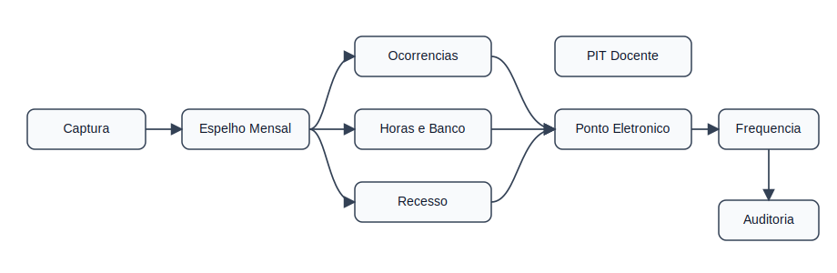
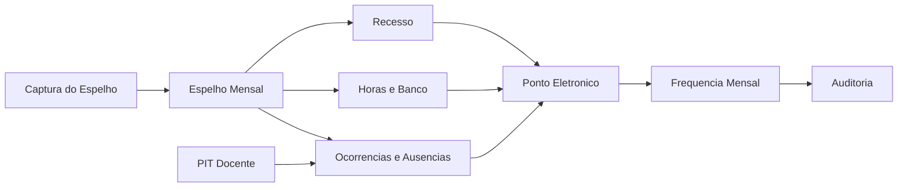
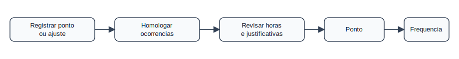
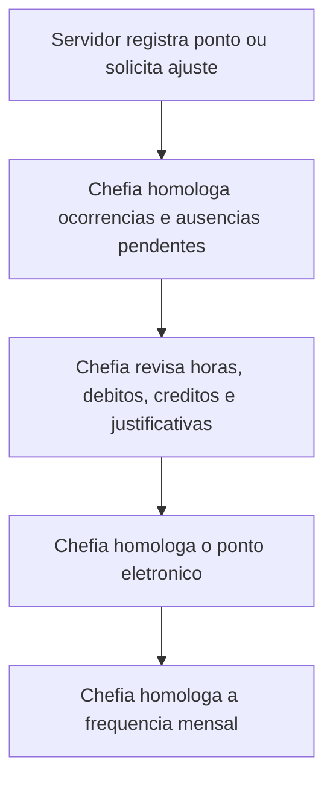

# Regras de Negócio — Homologação de Ponto e Frequência

Este índice organiza as regras por domínio, usando bounded contexts para separar
decisões de negócio, estados e validações. A fonte normativa é o Manual SIG
Ponto Eletrônico do Ifes, atualizado em 13/11/2019. O contrato de dados local
está em `docs/espelho-ponto-schema.yaml`.

## Context Map

## Bounded Contexts

- Espelho Mensal:
  [espelho-mensal.md](regras-homologacao/espelho-mensal.md)
  interpreta o JSON exportado.
- Ocorrências e Ausências:
  [ocorrencias-ausencias.md](regras-homologacao/ocorrencias-ausencias.md)
  trata solicitações e pendências antes do ponto.
- PIT Docente:
  [pit-docente.md](regras-homologacao/pit-docente.md)
  define regras específicas de docentes.
- Horas e Banco:
  [horas-banco.md](regras-homologacao/horas-banco.md)
  trata excedentes, autorização e saldo.
- Recesso:
  [recesso.md](regras-homologacao/recesso.md)
  trata período de recesso e compensação.
- Ponto Eletrônico:
  [ponto-eletronico.md](regras-homologacao/ponto-eletronico.md)
  fecha o ponto mensal.
- Frequência Mensal:
  [frequencia-mensal.md](regras-homologacao/frequencia-mensal.md)
  fecha a frequência mensal.
- Auditoria:
  [auditoria-alertas.md](regras-homologacao/auditoria-alertas.md)
  consolida alertas, checklist e limitações.

## Ordem Obrigatória

A homologação da frequência depende da homologação prévia do ponto eletrônico.
O ponto eletrônico depende da regularização das ocorrências e ausências em
aberto.

## Linguagem Ubíqua

| Termo | Definição |
|-------|-----------|
| Espelho Mensal | Visão mensal do ponto de um servidor no SIGRH |
| Registro Dia | Linha diária em `registros[]` |
| Ocorrência | Lançamento que justifica, complementa ou altera a leitura do dia |
| Ausência | Solicitação de afastamento, viagem ou atividade sem marcação regular |
| Ponto Homologado | Ponto eletrônico revisado e aceito pela chefia no SIGRH |
| Frequência Homologada | Fechamento mensal posterior ao ponto homologado |
| Débito Não Compensado | Saldo negativo diário ainda não tratado |
| Hora Excedente | Hora trabalhada além da jornada prevista |
| Hora Autorizada | Excedente ou dispensa aceita pela chefia |

## Leitura Recomendada

1. Comece por [espelho-mensal.md](regras-homologacao/espelho-mensal.md).
2. Revise pendências em
   [ocorrencias-ausencias.md](regras-homologacao/ocorrencias-ausencias.md).
3. Aplique regras específicas de
   [pit-docente.md](regras-homologacao/pit-docente.md),
   [horas-banco.md](regras-homologacao/horas-banco.md) e
   [recesso.md](regras-homologacao/recesso.md).
4. Feche com [ponto-eletronico.md](regras-homologacao/ponto-eletronico.md) e
   [frequencia-mensal.md](regras-homologacao/frequencia-mensal.md).
5. Use [auditoria-alertas.md](regras-homologacao/auditoria-alertas.md) para
   validações e limitações conhecidas.
