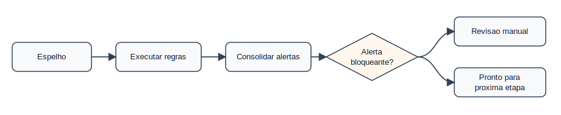
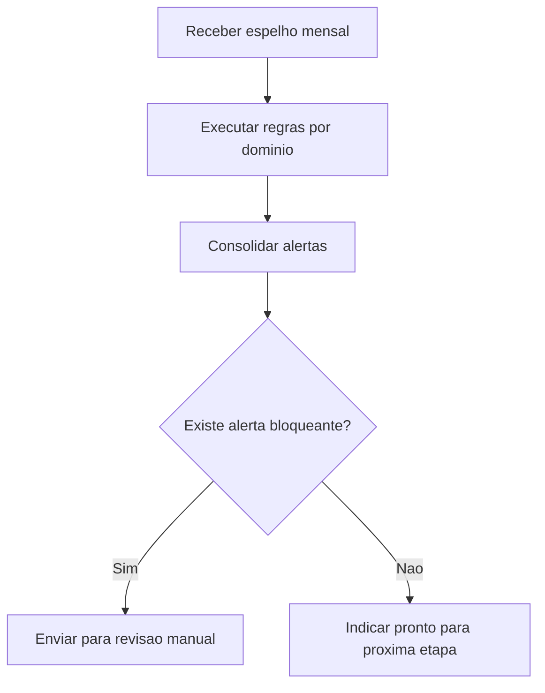

# Domínio — Auditoria e Alertas

## Responsabilidade

Este domínio transforma dados visíveis do espelho em alertas de revisão. Ele não
aprova ponto nem frequência; apenas indica riscos antes da ação da chefia.

## Processo

## Alertas Recomendados

| Alerta | Condição sugerida |
|--------|-------------------|
| Ocorrência pendente | `situacao` ou `mensagens` contém texto de pendência |
| Débito não compensado | `registros[].dnc` maior que `00:00` |
| Saldo mensal negativo | `resumo.saldo_horas_mes` começa com `-` |
| Excedente sem autorização | `he > 00:00` e `ha` igual a `00:00` ou ausente |
| Dia sem marcação e sem ocorrência | `marcacoes` e `ocorrencias` vazios em dia útil |
| Recesso com pendência | Ocorrência contém `Recesso` e texto indica `Tempo Pendente` |
| Resumo ausente | `resumo` é `null` em período que deveria estar processado |

## Checklist de Revisão

1. Confirmar servidor e `periodo_referencia`.
2. Verificar `mensagens` no topo do espelho.
3. Revisar dias sem marcação.
4. Revisar dias com `debito`, `dnc` ou saldo negativo.
5. Revisar ocorrências de PIT, afastamento, licença, recesso e atividade externa.
6. Conferir horas excedentes em `he` contra autorização em `ha` ou justificativa.
7. Conferir `resumo` mensal, principalmente saldo, débito e horas homologadas.
8. Homologar ocorrências e ausências pendentes no SIGRH.
9. Homologar o ponto eletrônico no SIGRH.
10. Homologar a frequência mensal no SIGRH.

## Limitações Conhecidas

- O espelho exportado não informa quem homologou ponto, frequência ou afastamento.
- O espelho exportado não contém anexos de ausência, documentos SIPAC ou plano de
  reposição de aulas do SIGAA.
- `status: completed` indica sucesso de captura, não conformidade administrativa.
- `situacao` pode ser diária ou textual conforme o SIGRH exibiu a página; não deve
  ser usada isoladamente para concluir homologação mensal.
- O manual descreve o fluxo operacional, mas a parametrização real do SIGRH pode
  variar por perfil, unidade, calendário e atualização do sistema.

## Eventos

| Evento | Severidade sugerida |
|--------|---------------------|
| `ResumoMensalAusente` | Média |
| `AusenciaPendente` | Alta |
| `DebitoNaoCompensado` | Média |
| `HoraExcedenteSemAutorizacao` | Média |
| `RecessoComTempoPendente` | Média |
| `ValidacaoExternaNecessaria` | Alta |
