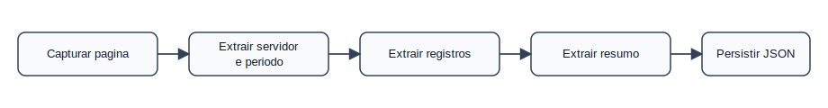
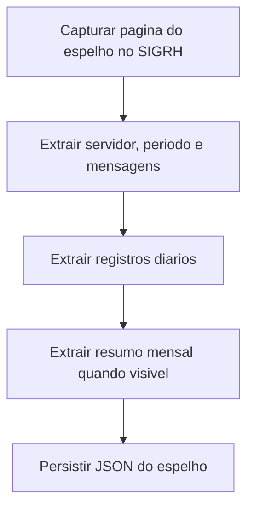

# Domínio — Espelho Mensal

## Responsabilidade

O domínio Espelho Mensal interpreta o JSON exportado pelo `homologacao-ponto`.
Ele não decide homologação. Ele entrega os dados capturados para os demais
domínios.

## Entidades

| Entidade | Origem | Uso |
|----------|--------|-----|
| `servidor` | Espelho de ponto | Identifica nome e SIAPE do servidor |
| `periodo_referencia` | Espelho de ponto | Define o mês/ano revisado |
| `registros[]` | Tabela diária | Base de marcações, ocorrências e saldos |
| `resumo` | Resumo mensal | Base para fechamento de horas |
| `mensagens` | Página do SIGRH | Avisos ou pendências visíveis |
| `fonte` | Captura do crawler | Rastreabilidade da página de origem |

## Processo

## Regras

- EM-001: A revisão é sempre feita por servidor e período.
  Critério: `servidor` e `periodo_referencia` identificam o alvo da revisão.
- EM-002: `status: completed` não significa homologado.
  Critério: o status indica captura com registros, não aprovação da chefia.
- EM-003: O resumo mensal prevalece sobre heurísticas por marcação.
  Critério: campos de `resumo` orientam o fechamento do mês.
- EM-004: Textos visíveis devem ser preservados.
  Critério: `mensagens`, `observacoes` e `textos_visiveis` não são descartados.
- EM-005: Falta de quatro marcações não implica irregularidade automática.
  Critério: jornada de até 30h pode não ter intervalo de almoço.
- EM-006: Marcação vazia não implica falta automática.
  Critério: ocorrências, afastamentos, PIT e resumo mensal são avaliados juntos.
- EM-007: Valores negativos representam pendência de compensação ou débito.
  Critério: valores `-HH:MM` em `resumo` exigem revisão antes do fechamento.

## Eventos Publicados

| Evento | Quando ocorre |
|--------|---------------|
| `EspelhoCapturado` | JSON foi persistido com servidor, período e registros |
| `ResumoMensalAusente` | `resumo` veio como `null` |
| `MensagemVisivelEncontrada` | `mensagens` contém aviso do SIGRH |

## Limitações

- O espelho não informa quem homologou ponto, frequência ou afastamento.
- O espelho não contém anexos, documentos SIPAC ou plano de reposição do SIGAA.
- `situacao` pode ser diária ou textual conforme o SIGRH exibiu a página.
