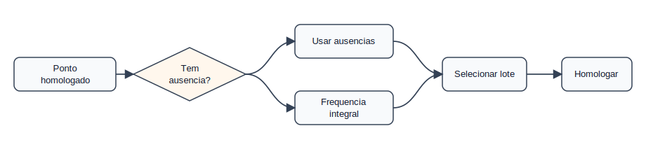
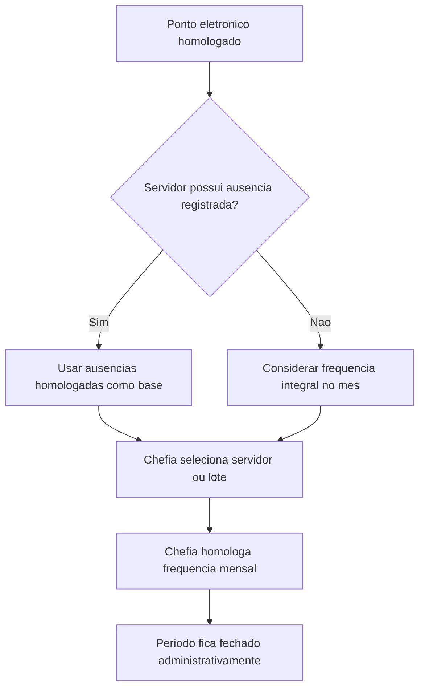

# Domínio — Frequência Mensal

## Responsabilidade

Este domínio representa o fechamento final da frequência mensal. Ele depende do
ponto eletrônico homologado e da regularização de ausências do período.

## Processo

## Regras

- FM-001: Frequência só deve ser homologada depois do ponto eletrônico.
  Critério: servidor/período está com ponto eletrônico homologado no SIGRH.
- FM-002: A homologação pode ser individual ou coletiva.
  Critério: todos os servidores selecionados cumprem as pré-condições.
- FM-003: Frequência mensal usa ausências registradas como base.
  Critério: ausências/afastamentos do período estão lançados e tratados.
- FM-004: Sem ausência registrada, o SIGRH considera frequência integral.
  Critério: não criar alerta apenas por `ocorrencias` vazio.
- FM-005: Frequência homologada torna o período administrativo fechado.
  Critério: ajustes posteriores exigem operação de desfazer frequência no SIGRH.
- FM-006: Relatórios devem distinguir ponto homologado de frequência homologada.
  Critério: não usar `status: completed` como substituto desses estados.

## Agregados

| Agregado | Invariantes |
|----------|-------------|
| `FrequenciaMensal` | Depende de `PontoMensal` homologado |
| `LoteHomologacaoFrequencia` | Todos os servidores precisam cumprir pré-condições |

## Eventos Consumidos

| Evento | Origem |
|--------|--------|
| `PontoProntoParaHomologacao` | Ponto Eletrônico |
| `PontoHomologadoNoSIGRH` | Confirmação manual no SIGRH |

## Eventos Publicados

| Evento | Quando ocorre |
|--------|---------------|
| `FrequenciaProntaParaHomologacao` | Ponto homologado e ausências tratadas |
| `FrequenciaHomologadaNoSIGRH` | Estado foi confirmado manualmente no SIGRH |
| `PeriodoAdministrativoFechado` | Frequência mensal foi homologada |

## Limitações

- O JSON exportado não confirma a homologação final da frequência.
- Ajustes depois da frequência homologada dependem de desfazer frequência no SIGRH.
