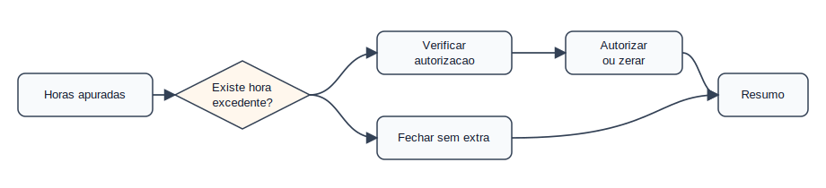
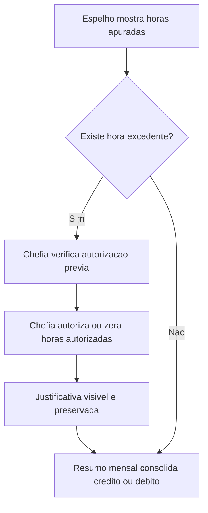

# Domínio — Horas e Banco

## Responsabilidade

Este domínio interpreta horas excedentes, horas autorizadas, débitos, créditos e
efeitos de banco de horas no fechamento do ponto eletrônico.

## Processo

## Regras

- HB-001: Hora excedente apurada não vira crédito automaticamente.
  Critério: `he` maior que `00:00` exige autorização da chefia.
- HB-002: Hora autorizada deve refletir em `ha` ou justificativa visível.
  Critério: sem autorização, a chefia pode zerar horas autorizadas no SIGRH.
- HB-003: Justificativa de horas excedentes deve ser preservada.
  Critério: `observacoes` ou `textos_visiveis` mantêm o texto capturado.
- HB-004: Banco de horas pode depender de autorização formal no SIPAC.
  Critério: o documento SIPAC não aparece como campo próprio no espelho.
- HB-005: Saldo retroativo deve respeitar limite administrativo informado.
  Critério: o efeito pode aparecer em `credito_acumulado` ou `resumo`.

## Agregados

| Agregado | Invariantes |
|----------|-------------|
| `ApuracaoDiariaHoras` | Usa `hr`, `hc`, `he`, `ha`, `hh`, `credito`, `debito` e `dnc` |
| `BancoHoras` | Consolida crédito acumulado e disponibilidade mensal |
| `AutorizacaoHoraExcedente` | Depende de decisão da chefia no SIGRH |

## Eventos Publicados

| Evento | Quando ocorre |
|--------|---------------|
| `HoraExcedenteApurada` | `he` maior que `00:00` |
| `HoraExcedenteSemAutorizacao` | `he > 00:00` e `ha` vazio ou `00:00` |
| `DebitoNaoCompensado` | `dnc` maior que `00:00` |
| `SaldoMensalNegativo` | Campo de saldo mensal começa com `-` |

## Limitações

- O documento SIPAC de autorização não é capturado no espelho.
- O saldo retroativo pode aparecer apenas como efeito no resumo mensal.
