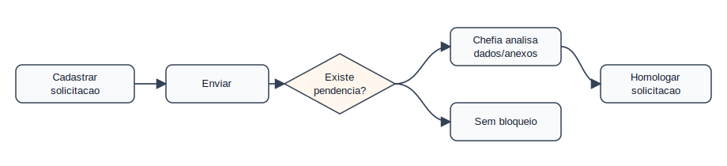
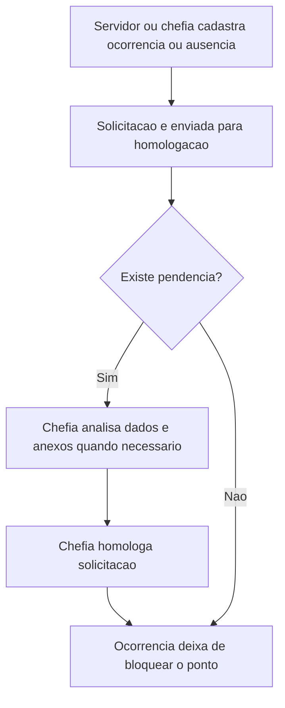

# Domínio — Ocorrências e Ausências

## Responsabilidade

Este domínio trata solicitações e lançamentos que justificam ou complementam a
frequência diária antes da homologação do ponto eletrônico.

## Processo

## Regras

- OA-001: Ocorrências e ausências em aberto bloqueiam a homologação do ponto.
  Critério: não há aviso ou situação pendente para o servidor/período.
- OA-002: Ausência, afastamento e viagem devem ter sido enviados.
  Critério: o SIGRH reflete ocorrência aceita ou pendência tratada.
- OA-003: A chefia deve analisar anexo quando o tipo de solicitação exigir.
  Critério: o espelho não comprova análise de anexo; conferir no SIGRH.
- OA-004: O servidor só altera ou exclui solicitações enquanto permitido.
  Critério: solicitação finalizada é estado administrativo fechado.
- OA-005: Chefia não pode homologar o próprio afastamento.
  Critério: a verificação exige dados do SIGRH fora do espelho exportado.
- OA-006: Frequência homologada bloqueia novo afastamento no período.
  Critério: novo ajuste exige desfazer frequência no SIGRH, quando aplicável.

## Agregados

| Agregado | Invariantes |
|----------|-------------|
| `OcorrenciaDia` | Pertence a um `RegistroDia` e preserva o texto visível |
| `SolicitacaoAusencia` | Precisa estar enviada antes de homologação pela chefia |
| `PendenciaHomologacao` | Bloqueia ponto eletrônico enquanto estiver aberta |

## Eventos Publicados

| Evento | Quando ocorre |
|--------|---------------|
| `OcorrenciaRegistrada` | `registros[].ocorrencias` contém lançamento visível |
| `AusenciaPendente` | Mensagem ou situação indica pendência |
| `AusenciaHomologada` | O SIGRH mostra estado aceito ou sem bloqueio visível |

## Integrações

- O domínio Ponto Eletrônico consome `AusenciaPendente`.
- O domínio Auditoria usa mensagens e textos visíveis para gerar alerta.
