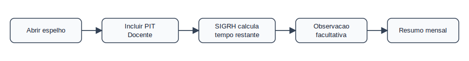
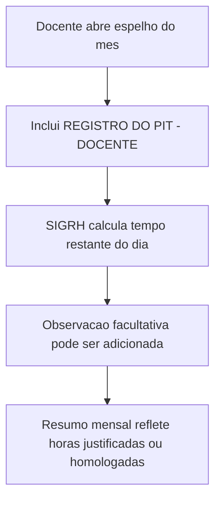

# Domínio — PIT Docente

## Responsabilidade

Este domínio trata o `REGISTRO DO PIT - DOCENTE` e variantes observadas no
espelho. Ele evita que dias de docente sem batida sejam classificados como falta
sem avaliar a ocorrência e o resumo mensal.

## Processo

## Regras

- PD-001: `REGISTRO DO PIT - DOCENTE` é ocorrência contabilizável.
  Critério: dia com PIT não é falta apenas por não ter batida.
- PD-002: O SIGRH calcula o tempo restante do dia no lançamento do PIT.
  Critério: o valor final é conferido em `hc`, `hh`, `dnc` e `resumo`.
- PD-003: Observação no PIT é facultativa.
  Critério: ausência de `observacoes` não invalida o PIT.
- PD-004: Afastamento docente com aula ativa exige plano de reposição.
  Critério: o espelho não contém o plano; conferir no SIGAA/SIGRH.

## Agregados

| Agregado | Invariantes |
|----------|-------------|
| `PitDocenteDia` | Deve estar associado a um `RegistroDia` |
| `PlanoReposicaoAula` | É externo ao espelho exportado |

## Eventos Publicados

| Evento | Quando ocorre |
|--------|---------------|
| `PitDocenteRegistrado` | Ocorrência contém PIT docente ou variante equivalente |
| `ValidacaoExternaNecessaria` | Docente afastado pode exigir plano no SIGAA |

## Limitações

- O espelho não contém o plano de reposição.
- O espelho não informa se o docente tinha aula ativa no período.
