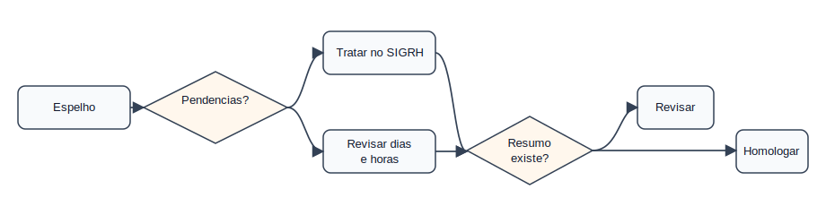
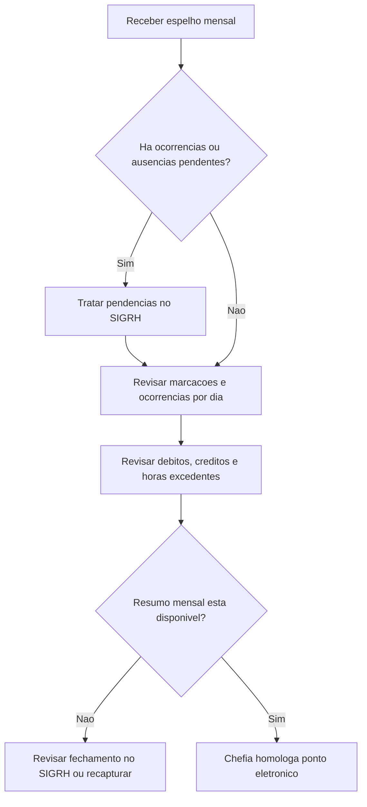

# Domínio — Ponto Eletrônico

## Responsabilidade

Este domínio decide se o espelho mensal está pronto para homologação do ponto
eletrônico pela chefia.

## Processo

## Regras

- PE-001: O ponto só deve ser homologado após tratar ocorrências pendentes.
  Critério: `mensagens`, `situacao` e `textos_visiveis` não indicam pendência.
- PE-002: Cada dia deve ser revisado com marcações e ocorrências juntas.
  Critério: avaliar `marcacoes`, `ocorrencias`, `debito`, `credito`, `dnc`, `hh`.
- PE-003: Débito diário não compensado exige decisão.
  Critério: `dnc` maior que `00:00` gera alerta de revisão.
- PE-004: Crédito diário exige validação de autorização quando for excedente.
  Critério: `he` maior que `00:00` é compatível com `ha` ou justificativa.
- PE-005: Dias sem marcação precisam ser classificados por motivo.
  Critério: conferir ocorrência, licença, afastamento, PIT, recesso, feriado ou falta.
- PE-006: O fechamento deve usar o resumo mensal quando disponível.
  Critério: `resumo.total_horas_homologadas` e saldos mensais orientam o aceite.
- PE-007: Meses sem `resumo` não são considerados fechados automaticamente.
  Critério: `resumo: null` exige revisão no SIGRH ou nova captura.
- PE-008: Homologação do ponto não equivale à homologação da frequência.
  Critério: após o ponto, ainda existe o fluxo de frequência mensal.

## Agregados

| Agregado | Invariantes |
|----------|-------------|
| `PontoMensal` | Pertence a um servidor e período |
| `RegistroDiaPonto` | Deve ser avaliado com marcações e ocorrências juntas |
| `ResumoHorasApuradas` | Quando presente, orienta fechamento mensal |

## Eventos Consumidos

| Evento | Origem |
|--------|--------|
| `AusenciaPendente` | Ocorrências e Ausências |
| `PitDocenteRegistrado` | PIT Docente |
| `HoraExcedenteSemAutorizacao` | Horas e Banco |
| `RecessoComTempoPendente` | Recesso |

## Eventos Publicados

| Evento | Quando ocorre |
|--------|---------------|
| `PontoProntoParaHomologacao` | Nenhum bloqueio visível impede o ponto |
| `PontoRequerRevisao` | Algum alerta impede fechamento automático |
| `PontoHomologadoNoSIGRH` | Estado foi confirmado manualmente no SIGRH |
