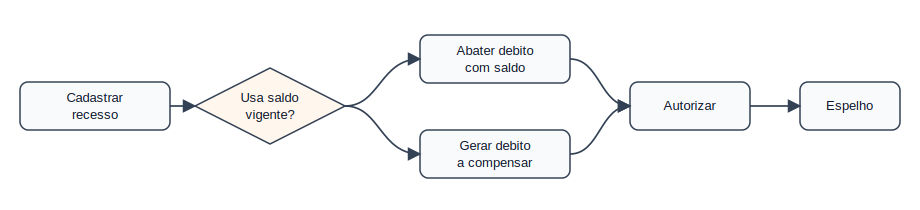
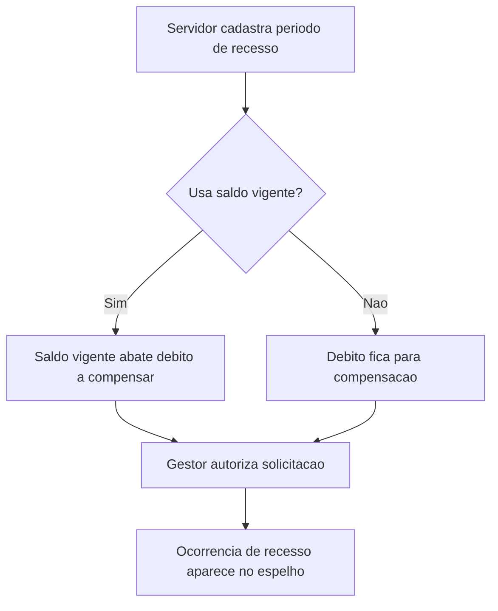

# Domínio — Recesso

## Responsabilidade

Este domínio trata solicitações de recesso, uso de saldo vigente para abatimento
de débito e efeitos de compensação no espelho mensal.

## Processo

## Regras

- RC-001: Recesso deve ter solicitação cadastrada e autorizada.
  Critério: ocorrência de recesso é compatível com estado autorizado no SIGRH.
- RC-002: Servidor escolhe se usa saldo vigente para abater débito.
  Critério: decisão completa pode não aparecer no espelho; conferir no SIGRH.
- RC-003: Recesso deve ser cruzado com saldo e crédito mensal.
  Critério: avaliar `credito_acumulado`, `credito_horas_disponivel_mes` e saldo.
- RC-004: Tempo pendente de compensação deve gerar alerta.
  Critério: textos de duração, período e tempo pendente são preservados.

## Agregados

| Agregado | Invariantes |
|----------|-------------|
| `SolicitacaoRecesso` | Precisa de autorização do gestor de ponto ou chefia |
| `CompensacaoRecesso` | Pode consumir saldo vigente ou gerar débito futuro |

## Eventos Publicados

| Evento | Quando ocorre |
|--------|---------------|
| `RecessoRegistrado` | Ocorrência contém `Recesso` |
| `RecessoComTempoPendente` | Texto visível indica tempo pendente |
| `SaldoUsadoParaRecesso` | Saldo/crédito indica abatimento de débito |

## Limitações

- A escolha de usar saldo vigente pode não aparecer completa no espelho.
- A lista de solicitações enviadas/autorizadas fica no SIGRH, fora do JSON.
